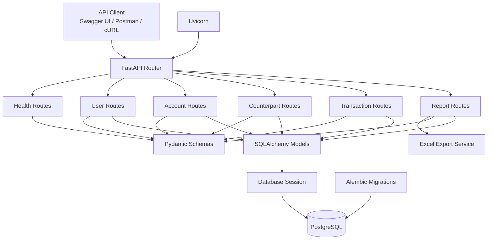
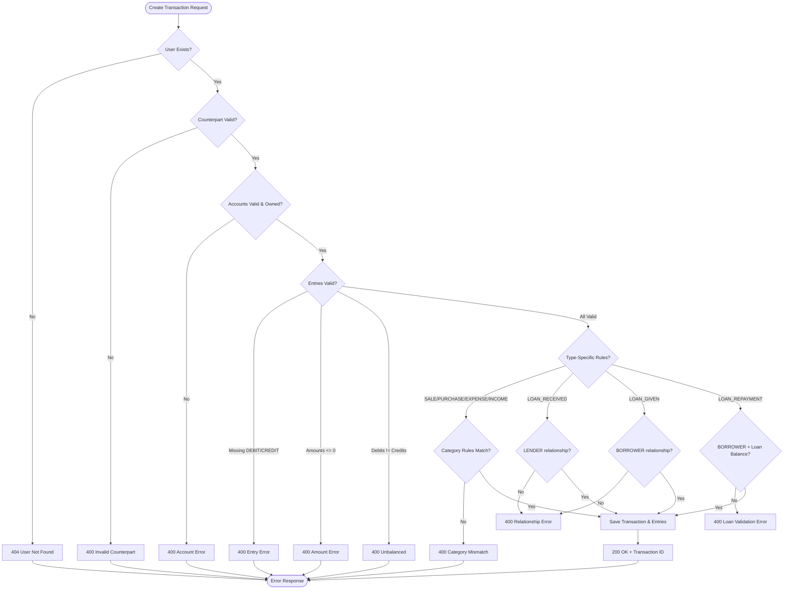
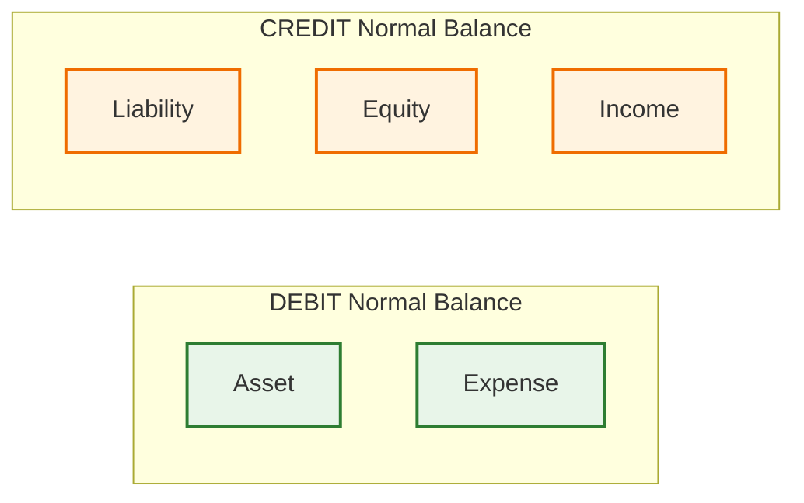
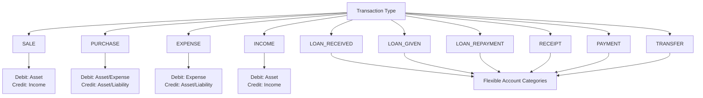

# DualEntry


## Overview

DualEntry is a backend financial accounting API that implements **double-entry bookkeeping** principles with transaction validation, financial reporting, and Excel export capabilities. Built with modern Python technologies, it provides a solid foundation for fintech applications, ERP systems, and accounting software.

### Key Highlights

| Feature | Description |
|---------|-------------|
| **Double-Entry Validation** | Enforces `Total Debits = Total Credits` on every transaction |
| **Account Categories** | Asset, Liability, Equity, Income, Expense with normal balance logic |
| **Counterpart Management** | Customer, Supplier, Lender, Borrower relationship types |
| **Financial Reports** | Trial Balance, Account Ledger, Income Statement, Balance Sheet |
| **Excel Export** | One-click `.xlsx` workbook with all financial reports |
| **Database Migrations** | Alembic-powered schema versioning |
| **API Documentation** | Auto-generated Swagger/OpenAPI at `/docs` |

---

## Tech Stack

| Technology | Purpose |
|------------|---------|
| Python | Backend language |
| FastAPI | REST API framework |
| Pydantic | Request/response validation |
| SQLAlchemy | ORM and database interaction |
| PostgreSQL | Relational database |
| Alembic | Database migrations |
| Uvicorn | ASGI server |
| OpenPyXL | Excel report generation |
| Pytest | Automated testing |

---

## Architecture



---

## Quick Start

### Prerequisites

- **Python** 3.11 or newer
- **PostgreSQL** 15+

### Local Development

```bash
# 1. Clone the repository
git clone https://github.com/0DhruvHere0/DualEntry
cd DualEntry

# 2. Create and activate virtual environment
python -m venv .venv
source .venv/bin/activate  # On Windows: .venv\Scripts\activate

# 3. Install dependencies
pip install --upgrade pip
pip install -r requirements.txt

# 4. Configure environment
cp .env.example .env
# Edit .env with your database credentials

# 5. Run database migrations
alembic upgrade head

# 6. Start the development server
uvicorn app.main:app --reload --host 0.0.0.0 --port 8000
```

**API available at:** `http://localhost:8000`  
**Interactive docs:** `http://localhost:8000/docs`  
**ReDoc:** `http://localhost:8000/redoc`

---

## Transaction Flow



---

## Account Categories & Normal Balances



| Category | Normal Balance | Increases With | Decreases With |
|----------|----------------|----------------|----------------|
| **Asset** | Debit | Debit | Credit |
| **Expense** | Debit | Debit | Credit |
| **Liability** | Credit | Credit | Debit |
| **Equity** | Credit | Credit | Debit |
| **Income** | Credit | Credit | Debit |

---

## Transaction Types & Validation Rules



---

## API Endpoints

<details>
<summary><strong>Click to expand all endpoints</strong></summary>

### Health
| Method | Endpoint | Description |
|--------|----------|-------------|
| `GET` | `/health` | Application health check |

### Users
| Method | Endpoint | Description |
|--------|----------|-------------|
| `POST` | `/users/` | Create a new user |
| `GET` | `/users/{user_id}` | Get user by ID |

### Accounts
| Method | Endpoint | Description |
|--------|----------|-------------|
| `POST` | `/accounts/` | Create a new account |
| `GET` | `/accounts/{account_id}/balance` | Get account balance |
| `GET` | `/accounts/{account_id}/entries` | Get account journal entries |

### Counterparts
| Method | Endpoint | Description |
|--------|----------|-------------|
| `POST` | `/counterparts/` | Create counterpart relationship |
| `GET` | `/counterparts/user/{user_id}` | List counterparts (filterable by type) |

### Transactions
| Method | Endpoint | Description |
|--------|----------|-------------|
| `POST` | `/transactions/` | Create a new transaction |
| `GET` | `/transactions/user/{user_id}` | List user transactions |
| `GET` | `/transactions/{transaction_id}` | Get transaction details |

### Reports
| Method | Endpoint | Description |
|--------|----------|-------------|
| `GET` | `/reports/trial-balance/{user_id}` | Trial balance report |
| `GET` | `/reports/account-ledger/{account_id}` | Account ledger with running balance |
| `GET` | `/reports/income-statement/{user_id}` | Income statement |
| `GET` | `/reports/balance-sheet/{user_id}` | Balance sheet |
| `GET` | `/reports/export/{user_id}` | **Excel export** (all reports) |

</details>

---

## API Testing

DualEntry includes an automated API test suite built with **Pytest** and FastAPI's `TestClient`.

The test suite covers the core business logic, validation rules, account calculations, counterpart relationships, transaction processing, and financial reporting behavior.

### Automated Testing Summary

**40 tests passed successfully.**

```text
40 passed, 0 failed
```

| Area | Coverage |
|------|----------|
| Health endpoint | ✅ |
| User creation & retrieval | ✅ |
| Duplicate users | ✅ |
| Account creation & ownership | ✅ |
| Account balances | ✅ |
| Account ledger | ✅ |
| Trial balance | ✅ |
| Counterpart relationships | ✅ |
| Counterpart filtering | ✅ |
| Transaction creation | ✅ |
| Double-entry balancing | ✅ |
| Missing debit/credit validation | ✅ |
| Account ownership validation | ✅ |
| Transaction category validation | ✅ |
| Loan received validation | ✅ |
| Loan given validation | ✅ |
| Loan repayment validation | ✅ |
| Loan balance calculations | ✅ |
| Partial loan repayment | ✅ |
| Outstanding loan protection | ✅ |
| Multiple transaction balance consistency | ✅ |
| Error handling | ✅ |

### Run Tests

From the project root:

```bash
python -m pytest -v
```

Example successful test run:

```text
=======================================================
40 passed, 0 failed
=======================================================
```

The automated tests use an isolated test database through the test configuration in `tests/conftest.py`, ensuring that test execution does not depend on production data.


### Manual API Verification

Additional API functionality, including financial reports and Excel export, was manually verified through Swagger UI.

### Testing Summary

| Area | Tested |
|------|--------|
| Health endpoint | ✅ |
| User creation & retrieval | ✅ |
| Account creation & ownership | ✅ |
| Duplicate account names | ✅ |
| Counterpart relationships | ✅ |
| Transaction validation | ✅ |
| Double-entry balancing | ✅ |
| Account category validation | ✅ |
| Account ledger | ✅ |
| Trial balance | ✅ |
| Income statement | ✅ |
| Balance sheet | ✅ |
| Excel export | ✅ |
| Error handling | ✅ |

The test suite focuses primarily on business-critical behavior such as double-entry balancing, account ownership, transaction category rules, counterpart relationships, loan validation, account balances, and financial consistency.
<details>
<summary><strong>Health API</strong></summary>


### GET /health
**Response**
```json
{
  "project": "DualEntry",
  "version": "1.0.0",
  "status": "Running"
}
```
</details>

<details>
<summary><strong>User API</strong></summary>

### POST /users/
**Request**
```json
{
  "name": "Validation User"
}
```
**Response (200)**
```json
{
  "id": 1,
  "name": "Validation User"
}
```

### GET /users/{user_id}
**Response (200)**
```json
{
  "id": 1,
  "name": "Validation User"
}
```

### Invalid User
**Response (404)**
```json
{
  "detail": "User not found"
}
```
</details>

<details>
<summary><strong>Account API</strong></summary>

### POST /accounts/
**Request**
```json
{
  "user_id": 1,
  "name": "Cash",
  "category": "ASSET"
}
```
**Response (200)**
```json
{
  "id": 1,
  "user_id": 1,
  "name": "Cash",
  "category": "ASSET"
}
```

### Duplicate Account Names
Multiple accounts with the same name are allowed for the same user.

**Response (201) - Second Cash account**
```json
{
  "id": 2,
  "user_id": 1,
  "name": "Cash",
  "category": "ASSET"
}
```

### GET /accounts/{account_id}/balance
**Response (200)**
```json
{
  "account_id": 1,
  "balance": "1500.00"
}
```
</details>

<details>
<summary><strong>Counterpart API</strong></summary>

### POST /counterparts/
**Request**
```json
{
  "user_id": 1,
  "counterpart_id": 2,
  "relationship_type": "CUSTOMER"
}
```
**Response (201)**
```json
{
  "id": 1,
  "user_id": 1,
  "counterpart_user_id": 2,
  "relationship_type": "CUSTOMER"
}
```

### GET /counterparts/user/{user_id}
**Response (200)**
```json
[
  {
    "id": 1,
    "user_id": 1,
    "counterpart_user_id": 2,
    "relationship_type": "CUSTOMER"
  }
]
```
</details>

<details>
<summary><strong>Transaction API</strong></summary>

### POST /transactions/ - Valid SALE
**Request**
```json
{
  "user_id": 1,
  "counterpart_id": 1,
  "transaction_type": "SALE",
  "description": "Cash sale",
  "entries": [
    {"account_id": 1, "entry_type": "DEBIT", "amount": 2000},
    {"account_id": 3, "entry_type": "CREDIT", "amount": 2000}
  ]
}
```
**Response (201)**
```json
{
  "id": 1,
  "user_id": 1,
  "counterpart_id": 1,
  "transaction_type": "SALE",
  "description": "Cash sale",
  "created_at": "2026-01-15T10:30:00Z",
  "entries": [
    {"id": 1, "account_id": 1, "entry_type": "DEBIT", "amount": "2000.00"},
    {"id": 2, "account_id": 3, "entry_type": "CREDIT", "amount": "2000.00"}
  ]
}
```
</details>

<details>
<summary><strong>Reporting API</strong></summary>

### GET /reports/trial-balance/{user_id}
**Response (200)**
```json
{
  "user_id": 1,
  "entries": [
    {"account_id": 1, "account_name": "Cash", "category": "ASSET", "debit_total": "2000.00", "credit_total": "0.00"},
    {"account_id": 3, "account_name": "Sales Income", "category": "INCOME", "debit_total": "0.00", "credit_total": "2000.00"}
  ],
  "total_debits": "2000.00",
  "total_credits": "2000.00",
  "is_balanced": true
}
```

### GET /reports/account-ledger/{account_id}
**Response (200)**
```json
{
  "account_id": 1,
  "account_name": "Cash",
  "category": "ASSET",
  "entries": [
    {"transaction_id": 1, "entry_type": "DEBIT", "amount": "2000.00", "running_balance": "2000.00", "created_at": "2026-01-15T10:30:00Z"}
  ]
}
```

### GET /reports/income-statement/{user_id}
**Response (200)**
```json
{
  "user_id": 1,
  "income": "2000.00",
  "expenses": "0.00",
  "net_income": "2000.00"
}
```

### GET /reports/balance-sheet/{user_id}
**Response (200)**
```json
{
  "user_id": 1,
  "assets": "2000.00",
  "liabilities": "0.00",
  "equity": "2000.00",
  "is_balanced": true
}
```
</details>

<details>
<summary><strong>Excel Export</strong></summary>

### GET /reports/export/{user_id}
**Response:** Downloads `financial_report.xlsx` containing:
- Trial Balance
- Account Ledgers
- Income Statement
- Balance Sheet
</details>

---

## Transaction Validation Examples

These validation tests demonstrate the business rules enforced by the API.

<details>
<summary><strong>Double-Entry Validation</strong></summary>

**Unbalanced Transaction**
```json
{
  "user_id": 1,
  "counterpart_id": 1,
  "transaction_type": "SALE",
  "entries": [
    {"account_id": 1, "entry_type": "DEBIT", "amount": 1000},
    {"account_id": 3, "entry_type": "CREDIT", "amount": 500}
  ]
}
```
**Response (400)**
```json
{
  "detail": "Total debits must equal total credits"
}
```

**Balanced Transaction**
```json
{
  "user_id": 1,
  "counterpart_id": 1,
  "transaction_type": "SALE",
  "entries": [
    {"account_id": 1, "entry_type": "DEBIT", "amount": 1000},
    {"account_id": 3, "entry_type": "CREDIT", "amount": 1000}
  ]
}
```
**Response (200)** - Transaction Created
</details>

<details>
<summary><strong>Account Ownership Validation</strong></summary>

**User 3 attempting to use Account 19 (belongs to User 4)**
```json
{
  "user_id": 3,
  "counterpart_id": 1,
  "transaction_type": "SALE",
  "entries": [
    {"account_id": 19, "entry_type": "DEBIT", "amount": 1000},
    {"account_id": 3, "entry_type": "CREDIT", "amount": 1000}
  ]
}
```
**Response (403)**
```json
{
  "detail": "Account 19 does not belong to this user"
}
```
</details>

<details>
<summary><strong>Transaction Category Validation</strong></summary>

### Loan Transaction Validation

Loan transactions enforce counterpart relationships and loan-balance rules.

| Transaction Type | Required Relationship | Purpose |
|------------------|----------------------|---------|
| `LOAN_RECEIVED` | `LENDER` | Records money received from a lender |
| `LOAN_GIVEN` | `BORROWER` | Records money lent to a borrower |
| `LOAN_REPAYMENT` | `BORROWER` | Records repayment of an outstanding loan |

#### Loan Received

A `LOAN_RECEIVED` transaction requires the counterpart to have a `LENDER` relationship.

#### Loan Given

A `LOAN_GIVEN` transaction requires the counterpart to have a `BORROWER` relationship.

#### Loan Repayment

A `LOAN_REPAYMENT` transaction requires:

- A `BORROWER` counterpart relationship
- A valid loan receivable account
- The repayment amount must not exceed the outstanding loan balance
- The transaction must remain balanced under double-entry rules

The API therefore prevents repayments from exceeding the amount currently owed.

### SALE - Credit must be Income account
**Invalid: Credit to Asset**
```json
{
  "transaction_type": "SALE",
  "entries": [
    {"account_id": 1, "entry_type": "DEBIT", "amount": 1000},  // Asset
    {"account_id": 2, "entry_type": "CREDIT", "amount": 1000}  // Asset (wrong)
  ]
}
```
**Response (400)**
```json
{
  "detail": "SALE credit entry must use an Income account"
}
```

**Valid: Credit to Income**
```json
{
  "transaction_type": "SALE",
  "entries": [
    {"account_id": 1, "entry_type": "DEBIT", "amount": 1000},   // Asset
    {"account_id": 3, "entry_type": "CREDIT", "amount": 1000}   // Income
  ]
}
```
**Response (201)** - Transaction Created

---

### PURCHASE - Debit: Asset/Expense, Credit: Asset/Liability
**Invalid: Credit to Income**
```json
{
  "transaction_type": "PURCHASE",
  "entries": [
    {"account_id": 4, "entry_type": "DEBIT", "amount": 1000},   // Expense
    {"account_id": 3, "entry_type": "CREDIT", "amount": 1000}   // Income (wrong)
  ]
}
```
**Response (400)**
```json
{
  "detail": "PURCHASE credit entry must use an Asset or Liability account"
}
```

**Valid: Credit to Liability**
```json
{
  "transaction_type": "PURCHASE",
  "entries": [
    {"account_id": 4, "entry_type": "DEBIT", "amount": 1000},   // Expense
    {"account_id": 5, "entry_type": "CREDIT", "amount": 1000}   // Liability
  ]
}
```
**Response (201)** - Transaction Created

---

### EXPENSE - Debit: Expense, Credit: Asset/Liability
**Invalid: Debit to Asset**
```json
{
  "transaction_type": "EXPENSE",
  "entries": [
    {"account_id": 1, "entry_type": "DEBIT", "amount": 1000},   // Asset (wrong)
    {"account_id": 5, "entry_type": "CREDIT", "amount": 1000}   // Liability
  ]
}
```
**Response (400)**
```json
{
  "detail": "EXPENSE debit entry must use an Expense account"
}
```

**Valid: Debit to Expense**
```json
{
  "transaction_type": "EXPENSE",
  "entries": [
    {"account_id": 4, "entry_type": "DEBIT", "amount": 1000},   // Expense
    {"account_id": 5, "entry_type": "CREDIT", "amount": 1000}   // Liability
  ]
}
```
**Response (201)** - Transaction Created
</details>

<details>
<summary><strong>Counterpart Relationship Validation</strong></summary>

**Transaction without counterpart relationship**
```json
{
  "user_id": 1,
  "counterpart_id": 999,  // No relationship exists
  "transaction_type": "SALE",
  "entries": [...]
}
```
**Response (400)**
```json
{
  "detail": "Counterpart relationship does not exist"
}
```

**Counterpart cannot be same as user**
```json
{
  "user_id": 1,
  "counterpart_id": 1,  // Same as user_id
  "transaction_type": "SALE",
  "entries": [...]
}
```
**Response (400)**
```json
{
  "detail": "Counterpart cannot be the same as the transaction user"
}
```
</details>

---

## Example Usage

### Create a Transaction (Cash Sale)

```bash
curl -X POST "http://localhost:8000/transactions/" \
  -H "Content-Type: application/json" \
  -d '{
    "user_id": 1,
    "counterpart_id": 2,
    "transaction_type": "SALE",
    "description": "Cash sale of services",
    "entries": [
      {"account_id": 3, "entry_type": "DEBIT", "amount": 5000.00},
      {"account_id": 5, "entry_type": "CREDIT", "amount": 5000.00}
    ]
  }'
```

**Response:**
```json
{
  "id": 10,
  "user_id": 1,
  "counterpart_id": 2,
  "transaction_type": "SALE",
  "description": "Cash sale of services",
  "created_at": "2026-01-15T10:30:00Z",
  "entries": [
    {"id": 19, "account_id": 3, "entry_type": "DEBIT", "amount": "5000.00"},
    {"id": 20, "account_id": 5, "entry_type": "CREDIT", "amount": "5000.00"}
  ]
}
```

### Get Financial Reports

```bash
# Trial Balance
curl "http://localhost:8000/reports/trial-balance/1"

# Income Statement
curl "http://localhost:8000/reports/income-statement/1"

# Balance Sheet
curl "http://localhost:8000/reports/balance-sheet/1"

# Excel Export (downloads .xlsx file)
curl -o financial_report.xlsx "http://localhost:8000/reports/export/1"
```

---

## Financial Reports

### Trial Balance
Verifies `Total Debits = Total Credits` across all accounts.

### Account Ledger
Shows individual entries with **running balance** per account.

### Income Statement
```
Revenue (Income)      150,000
Cost of Goods Sold   -45,000
Gross Profit          105,000
Operating Expenses   -30,000
Net Income            75,000
```

### Balance Sheet
```
ASSETS                          LIABILITIES & EQUITY
Cash                 100,000    Accounts Payable    25,000
Accounts Receivable  50,000     Loans Payable       50,000
Inventory            30,000     Equity              105,000
─────────────────────           ─────────────────────
Total Assets         180,000    Total L&E           180,000
```

---

## Project Structure

```
DualEntry/
├── app/
│   ├── api/
│   │   ├── router.py
│   │   └── routes/
│   │       ├── account.py
│   │       ├── counterpart.py
│   │       ├── health.py
│   │       ├── report.py
│   │       ├── transaction.py
│   │       └── user.py
│   ├── database/
│   │   ├── base.py
│   │   ├── dependency.py
│   │   └── session.py
│   ├── models/
│   │   ├── account.py
│   │   ├── counterpart.py
│   │   ├── entry.py
│   │   ├── transaction.py
│   │   └── user.py
│   ├── schemas/
│   │   ├── account.py
│   │   ├── counterpart.py
│   │   ├── report.py
│   │   ├── transaction.py
│   │   └── user.py
│   ├── services/
│   │   └── excel_export.py
│   └── main.py
├── alembic/
│   ├── versions/
│   │   └── env.py
├── tests/
│   ├── conftest.py
│   ├── test_accounts.py
│   ├── test_counterparts.py
│   ├── test_health.py
│   ├── test_transactions.py
│   └── test_users.py
├── .env.example
├── .gitignore
├── requirements.txt
└── README.md
```

---